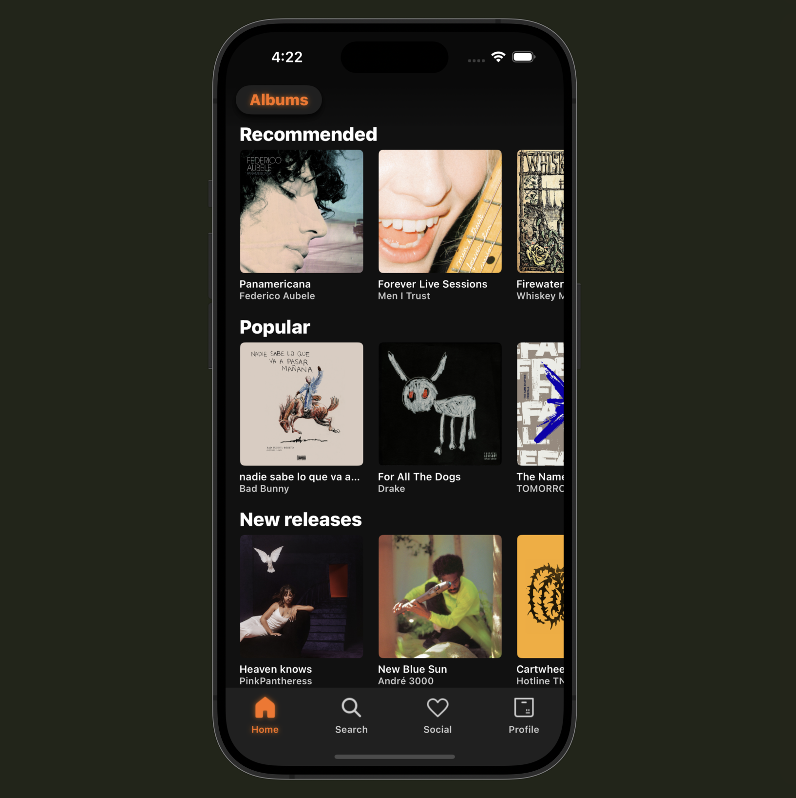
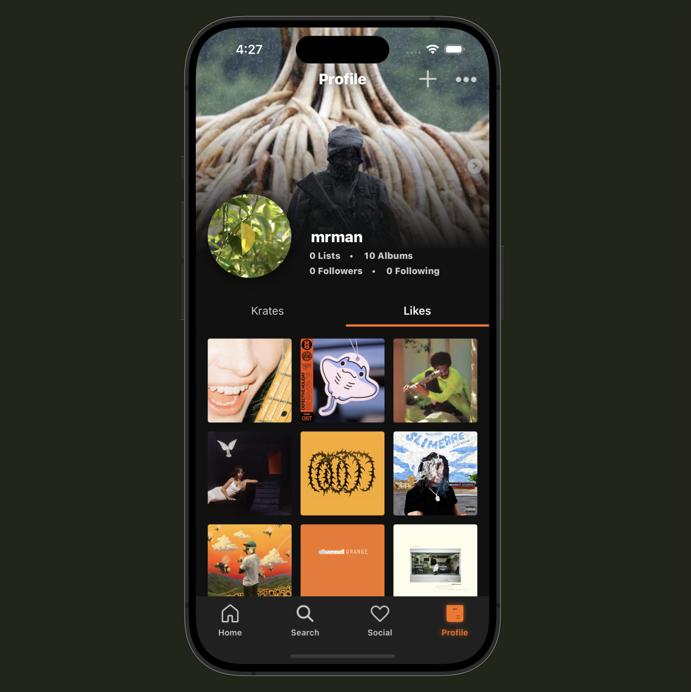
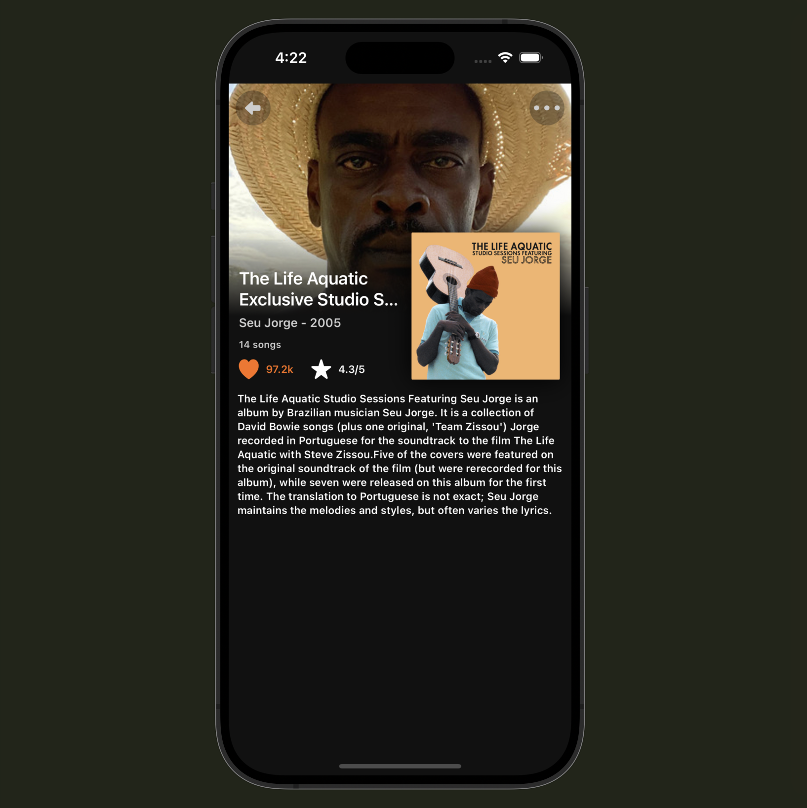
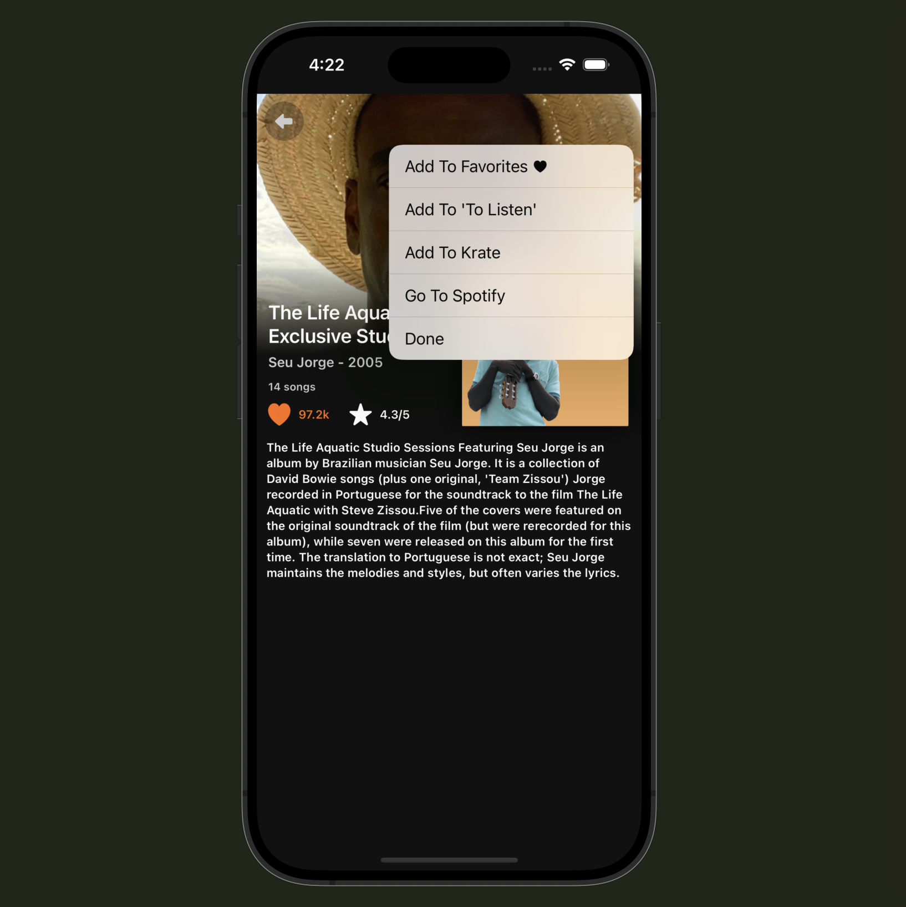
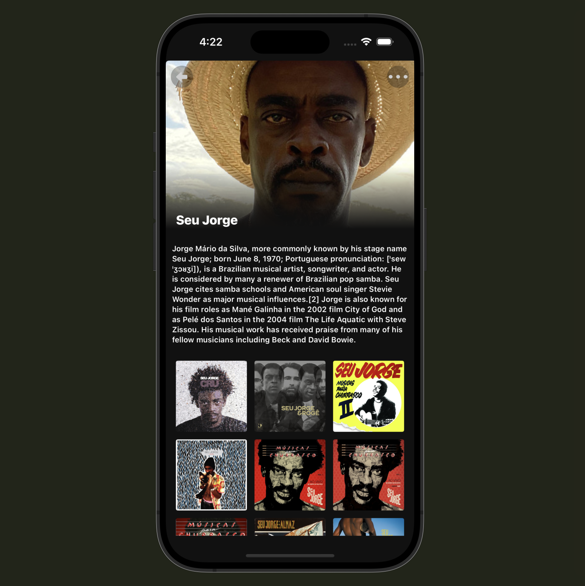
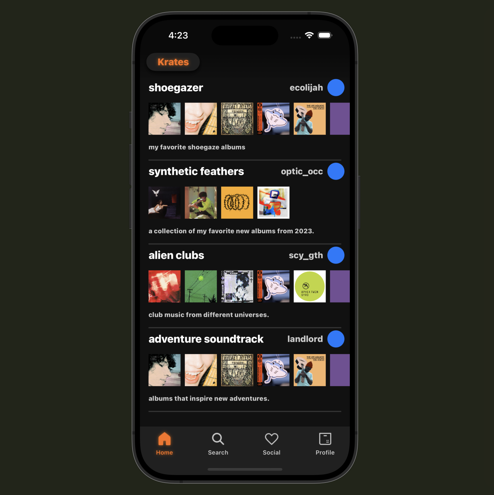
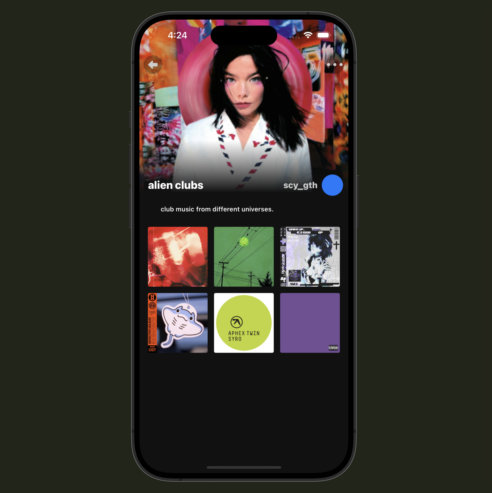
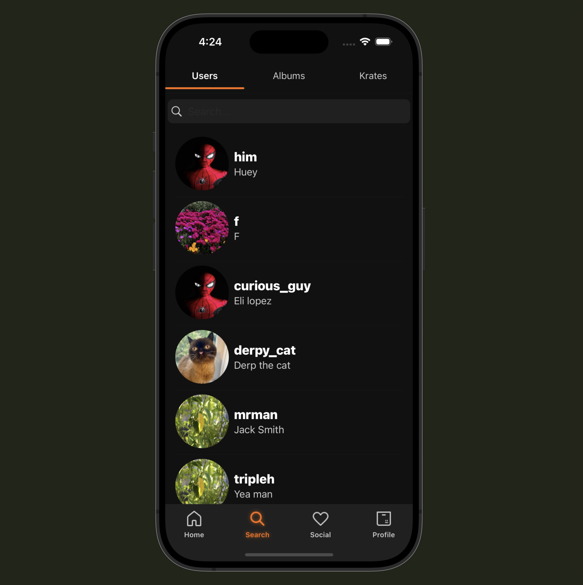
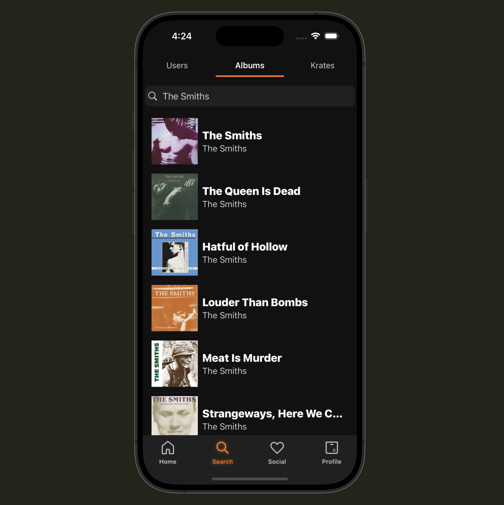
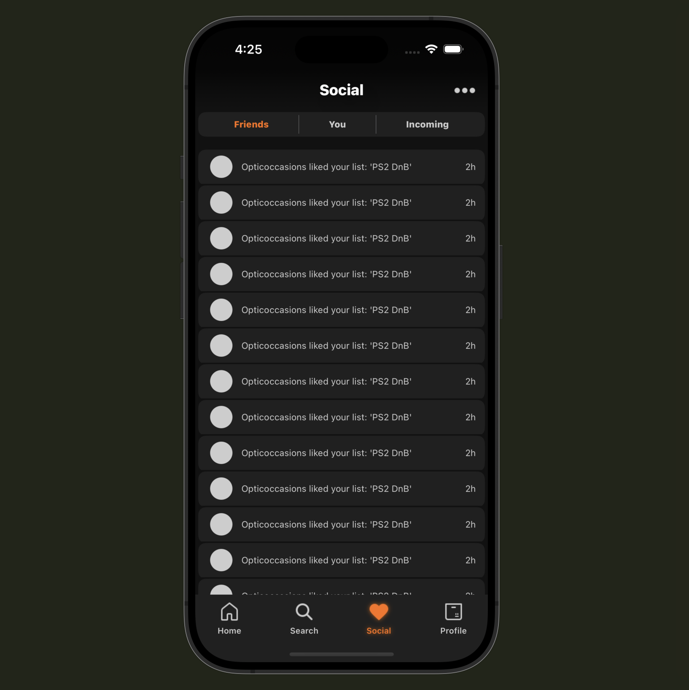

# Krates
Music organization and discovery, with an emphasis on albums as a complete body of work.

## Features:
- Discover and share your own personalized virtual collection of albums. 
- Create a list of albums by any criteria, theme, genre, era, etc.
- These lists are called 'Krates', and can be shared and interacted with much like any other social media post. 
- Follow your friends, or favorites creators to expand your tastes.
- 'To listen' list, for those albums that would be better listened to later on.
- Global 'liked albums' and 'liked krates' for short term collection or archival purposes.
- Every piece of music is just one click away from listening to on spotify.

## Inspiration: 
- I really enjoy collecting, organizing and archiving my watch history on Letterboxd, and i was upset there was nothing similar in the space of music. So, i decided to solve that problem for myself, and create an efficient digital platform to my liking.

## Future Plans: 
- I plan to release the app on the app store when i am done developing it to gain experience with deploying an app. Also, creating marketing plans to try to get more users. Im also interested in solving the problems that may appear in the face of scalability.

## Demo-Images:

